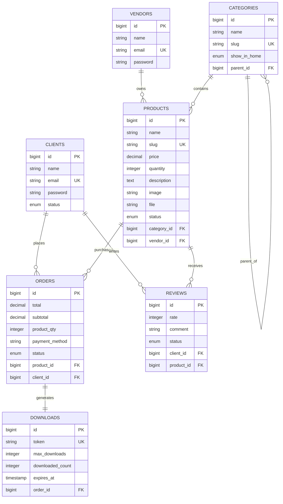

# Digital Products Store

## Overview

The `digital-products-store` repository is a RESTful marketplace API built with Laravel that enables vendors to sell digital products and clients to purchase and download them securely.

The project is a **Digital Products Marketplace** supporting **Multi-authentication ( vendor / client )**, product management, digital product delivery and **payment processing via [ChargilyPay](https://chargily.com/)**. Vendors can upload digital modules and clients can securely purchase and download them.

The platform supports:

* Multi-authentication ( Vendor / Client ).
* Product management.
* Order management.
* Product reviews and ratings.
* Secure digital file delivery.
* Online payments through [ChargilyPay](https://chargily.com/).
* Storefront browsing for guests.

Typical products include:

* Source code.
* Templates.
* E-books.
* Courses.
* Design assets.
* ZIP packages.

## Key Features

### Vendor Features

* Vendor registration and authentication
* Dashboard analytics
* Category management
* Product management
* Product image uploads
* Digital file uploads
* Order tracking
* Customer management
* Review management
* Store profile management

### Client Features

* Registration and authentication
* Purchase digital products
* Download purchased products
* Order history
* Product reviews
* Profile management
* Browse products

### Marketplace Features

* Public storefront
* Product search and filtering
* Product ratings
* SEO-friendly slugs
* Secure payment integration

## Payment Process


## Project Structure

The application follows a layered architecture :

- Controllers handle incoming requests.
- Services contain business logic.
- Form Requests handle validation.
- Resources transform API responses.
- Models interact with the database.

## Database Schema



## Requirements

Before installing, ensure your environment meets these requirements :

- PHP ( version 8.x )
- Laravel ( version 10.x )
- MySQL database
- Composer
- Web server ( Xampp )

## Installation

Follow these steps to install and set up `digital-products-store` project :

1. **Clone the repository :**
   ```bash
   git clone https://github.com/rayanguendouz/digital-products-store.git
   cd digital-products-store
   ```

2. **Install dependencies :**
   ```bash
   composer install
   ```

3. **Create the environment file :**

    ```bash
    cp .env.example .env
    ```

4. **Configure your database credentials in .env :**
    ```.env
    DB_CONNECTION=mysql
    DB_HOST=127.0.0.1
    DB_PORT=3306
    DB_DATABASE=digital-products-store
    DB_USERNAME=root
    DB_PASSWORD=
    ```

5. **Configure your payment credentials in .env :**
    ```.env
    CHARGILY_MODE=test
    CHARGILY_PUBLIC_KEY=your_public_key
    CHARGILY_SECRET_KEY=your_secret_key
    ```

6. **Generate the application key :**
    ```bash
    php artisan key:generate
    ```

7. **Run database migrations and seeders :**
   ```bash
   php artisan migrate --seed
   ```

8. **Create a symbolic link for storage :**
    ```bash
    php artisan storage:link
    ```

## Usage

Follow these steps to run `digital-products-store` project :


1. **Run the application :**
   ```bash
   php artisan serve
   ```

2. **Access the API :**
   - API base URL : [http://localhost:8000/v1/api](http://localhost:8000/v1/api)


## API testing with Postman

You can test all available API endpoints using the provided Postman collection.

### 1. Download the Collection

[Digital Products Store Postman Collection](collection.json)

### 2. How to Use

1. Open [Postman](https://www.postman.com/downloads/)
2. Click `Import` and Choose the file you downloaded above.
3. Set the `url` environment variable to your API base URL (e.g `http://127.0.0.1:8000/api/v1`)
4. Use the available requests grouped under :  

   📁 Vendor Routes  
       ├── 📁 Guest Routes  
       │    │  
       ├── 📁 Auth Routes  
       │    │  
       │    ├── 📁 Dashboard  
       │    ├── 📁 Categories  
       │    ├── 📁 Products  
       │    ├── 📁 Reviews  
       │    ├── 📁 Orders  
       │    ├── 📁 Clients  
       │    ├── 📁 Profile  
       │    │  
   📁 Client Routes  
       ├── 📁 Guest Routes  
       │    │  
       ├── 📁 Auth Routes  
       │    │  
       │    ├── 📁 Orders  
       │    ├── 📁 Downloads  
       │    ├── 📁 Checkout  
       │    ├── 📁 Reviews  
       │    ├── 📁 Profile
       │    │  
   📁 Front Routes  
       ├── 📁 Home  
       ├── 📁 Shop  
       └── 📁 Reviews  

5. Check the full documentation via the following link : https://documenter.getpostman.com/view/YOUR_WORKSPACE_ID/YOUR_DOCUMENT_ID

## Roadmap

You can work on the following improvements :

- Wishlist
- Product favorites
- Coupons and discounts
- Vendor subscriptions
- Product licensing system
- Advanced analytics
- Email notifications
- Multi-language support

## Contributing

We welcome contributions! Please follow these guidelines :

- Fork the repository and create a new branch for your feature or fix.
- Write clear commit messages and document your code.
- Ensure all tests pass before submitting a pull request.
- Follow the established code style and project structure.
- Open an issue for discussion before major changes.

## License

This project is open-sourced under the [MIT License](LICENSE).

---

Thank you for using `digital-products-store`! For questions or support, please open an issue on GitHub.
