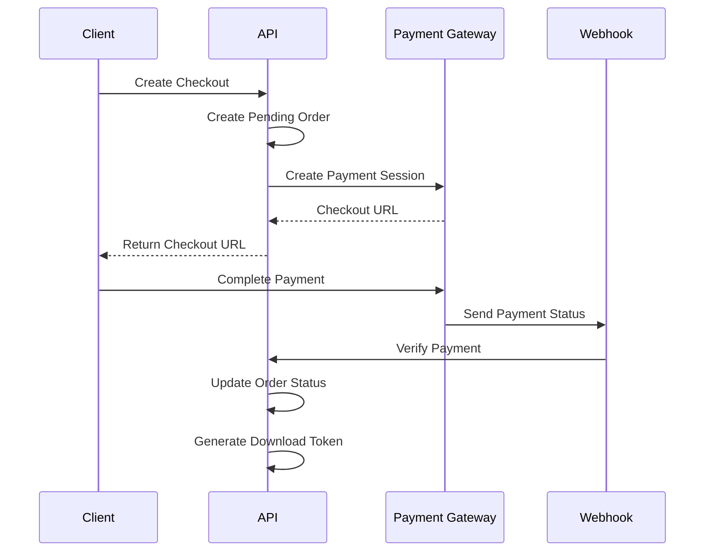
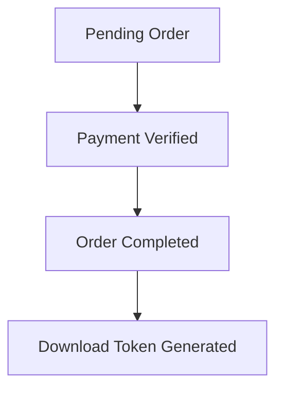

## Payment Gateway Process

The application uses a flexible payment gateway architecture that currently supports **ChargilyPay** and can be extended to support additional providers such as Stripe and PayPal.

### Payment Flow



### Step 1: Create Checkout

The client initiates a purchase by sending a checkout request.

```http
POST /api/v1/client/checkout
Authorization: Bearer {jwt-token}
```

Request Body:

```json
{
    "product_id": 1,
    "product_quantity": 2,
    "payment_method": "cib"
}
```

### Step 2: Create Pending Order

The API:

* Validates the request.
* Checks product availability.
* Creates an order with a `pending` status.
* Reserves the requested quantity.

### Step 3: Create Payment Session

The selected payment gateway creates a checkout session and returns a secure payment URL.

Example response:

```json
{
    "success": true,
    "message": "Order created successfully.",
    "data": {
        "order": {
            "id": 14,
            "status": "pending"
        },
        "checkout_url": "https://pay.chargily.dz/..."
    }
}
```

### Step 4: Customer Completes Payment

The client application redirects the customer to the returned checkout URL.

Supported payment methods:

* CIB
* Edahabia

### Step 5: Payment Verification

After payment completion, the payment gateway sends a webhook request to the application.

The webhook endpoint:

* Validates the payment event.
* Verifies the transaction status.
* Identifies the related order using metadata.

### Step 6: Order Completion

If the payment is successful:

* Order status becomes `completed`.
* Download record is generated.
* Download token is issued.



### Order Status Lifecycle

| Status    | Description                        |
| --------- | ---------------------------------- |
| pending   | Order created and awaiting payment |
| completed | Payment successfully verified      |
| failed    | Payment failed                     |
| canceled  | Order canceled                     |

### Download Protection

Digital downloads are protected using secure tokens.

Each download record includes:

* Unique download token.
* Maximum download attempts.
* Expiration date.
* Order ownership validation.

Downloads are available only after successful payment verification.

### Security Considerations

* JWT authentication protects checkout endpoints.
* Payment verification relies on gateway webhooks.
* Orders are not marked as paid from client-side redirects.
* Download access requires a valid token.
* All payment transactions are verified server-side.

```
```
