# Deploy Laravel App to EC2

lorem lorem lorem lorem lorem lorem lorem lorem lorem lorem.

## Overview

The `deploy-laravel-app-to-ec2` repository is ... implements a the complete `CI/CD` pipeline for deploying a Laravel application using :

- Apache.
- Docker ( Docker Compose ).
- Terraform.
- Ansible.
- GitHub Actions.
- AWS ( EC2 + RDS + S3 + DynamoDB ).

## What this project demonstrates

- Automated CI/CD pipelines.
- Dockerized Laravel app.
- Infrastructure as code.
- Configuration Management.

## Project Structure

    ├── 📁 .github  
    ├── 📁 ansible
    ├── 📁 apache  
    ├── 📁 app  
    ├── 📁 docs  
    ├── 📁 scripts  
    ├── 📁 terraform  
    ├── 📄 docker-compose.yml  
    ├── 📄 Dockerfile  
    └── 📄 README.md  

## Requirements

**⩩ AWS account ( tab the [link](https://signin.aws.amazon.com/signup?request_type=register) and follow the steps ) :**  

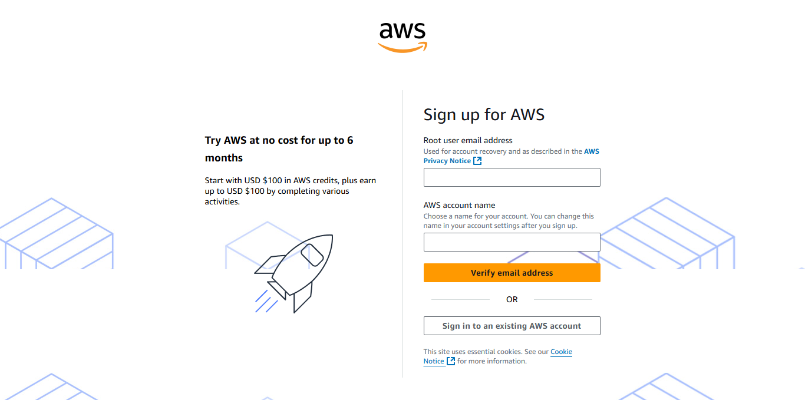  

**⩩ Key Pair ( from AWS panel ) :**  

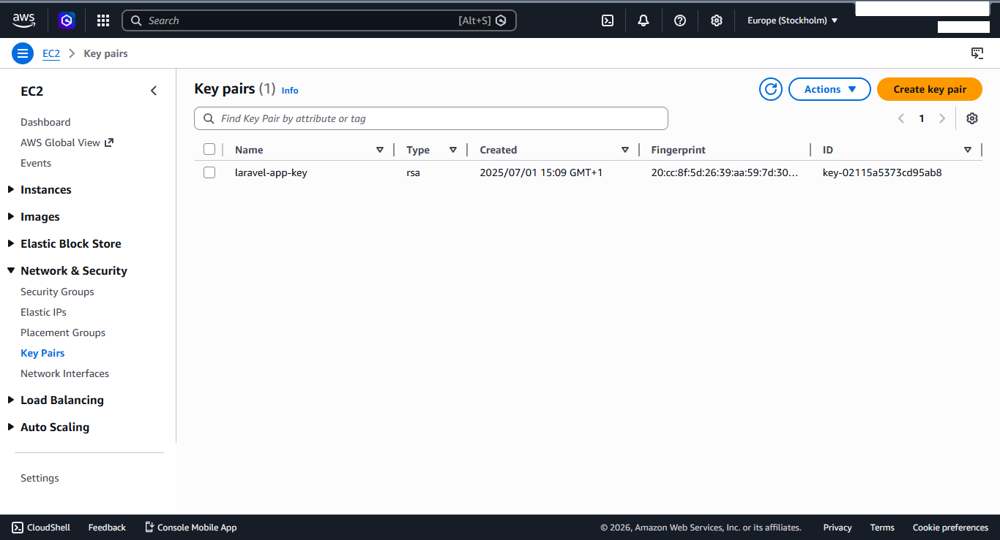  

**⩩ S3 bucket for terraform backend ( from AWS panel ) :**  

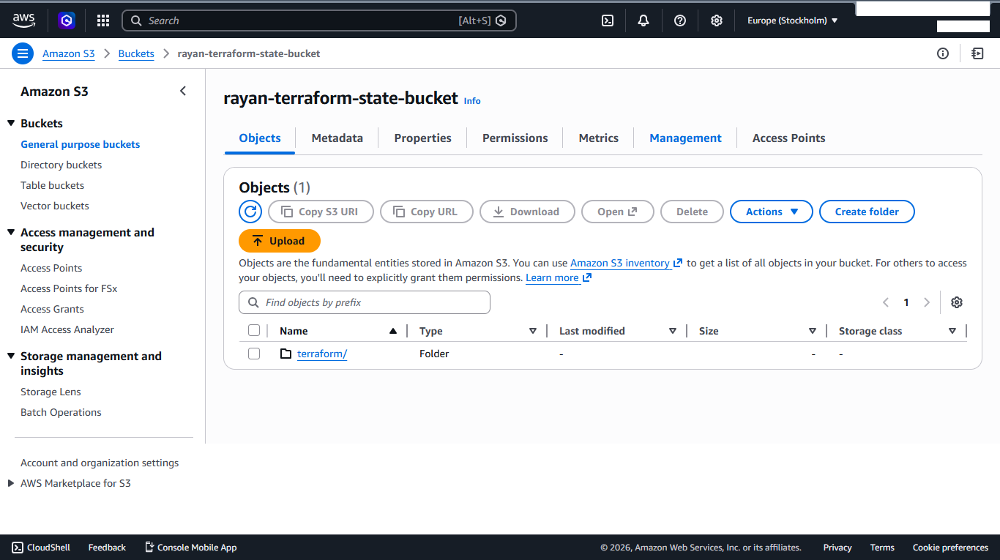  

**⩩ DynamoDB table for terraform locking ( from AWS panel ) :**  

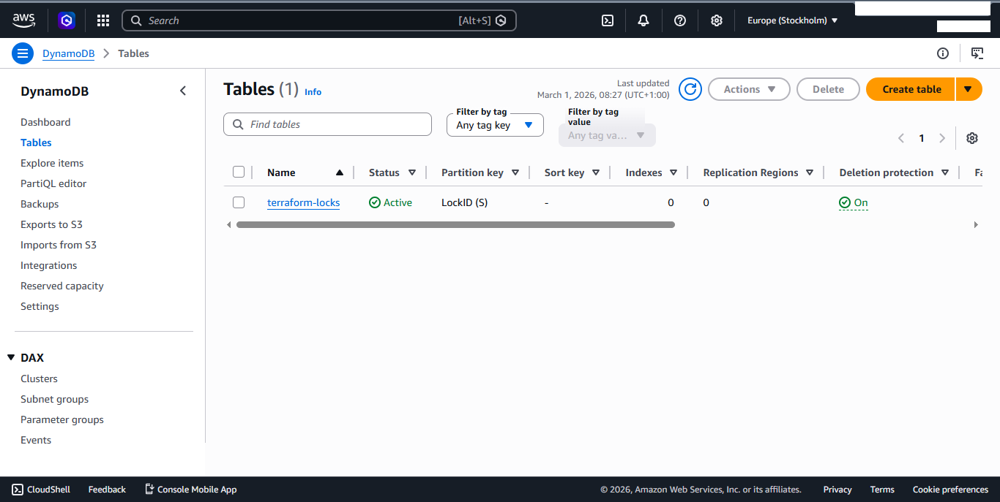  

**⩩ GitHub secrets keys ( tab the [link](https://github.com/<your-username>/<your-repo>/settings/secrets/actions) and follow the steps ) :**  

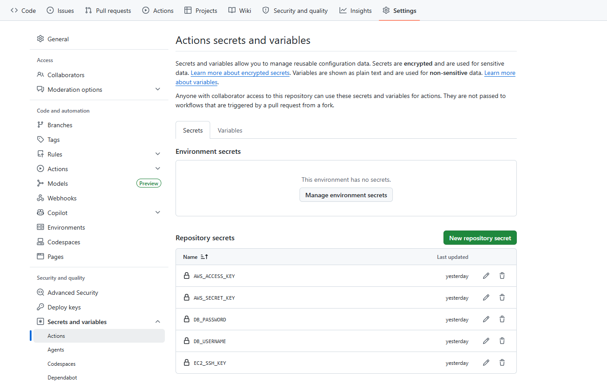  

This is what these keys represent :

- `EC2_SSH_KEY` : Private SSH key used by Ansible to connect to the EC2 instance.
- `AWS_ACCESS_KEY` : AWS Access Key ID used to authenticate Terraform.
- `AWS_SECRET_KEY` : AWS Secret Access Key paired with the Access Key ID.
- `DB_USERNAME` : Master username for the RDS MySQL database. Terraform uses it when creating the RDS instance.
- `DB_PASSWORD` : Master password for the RDS MySQL database. Terraform uses it when creating the RDS instance.

## Deployment flow explained

**1. Push changes or use manual trigger :**

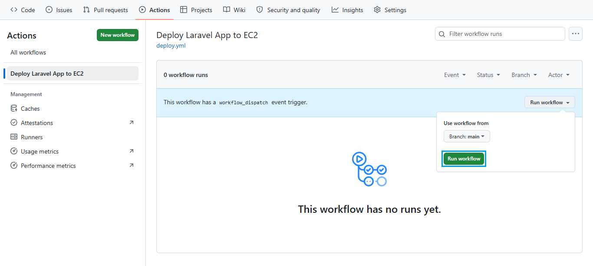  

**2. Run GitHub Actions jobs sequentially :**

- This all steps executed after run `Build` job :

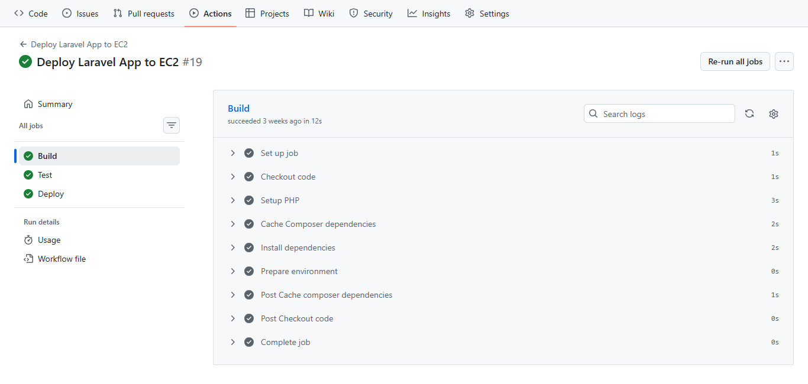  

- This all steps executed after run `Test` job :

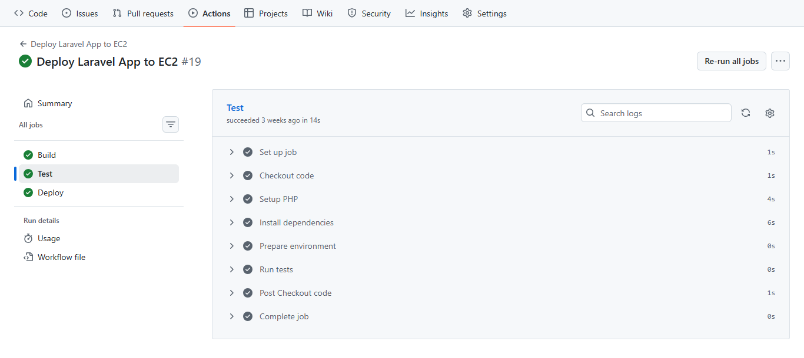  

- This all steps executed after run `Deploy` job :

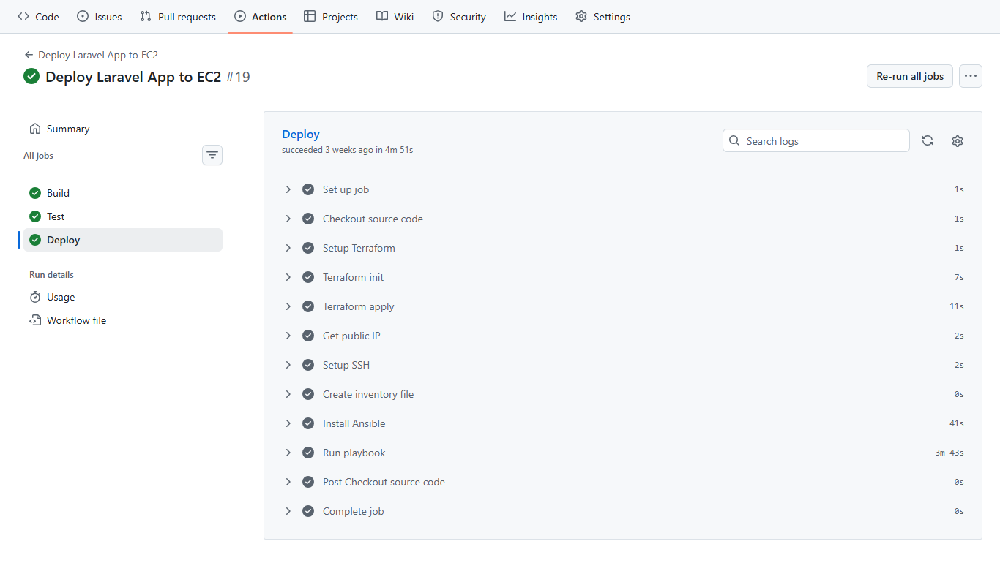  

**3. Terraform provisioning :**

- This is the EC2 instance we obtain after running the IAC ( Infrastructure as Code ) :

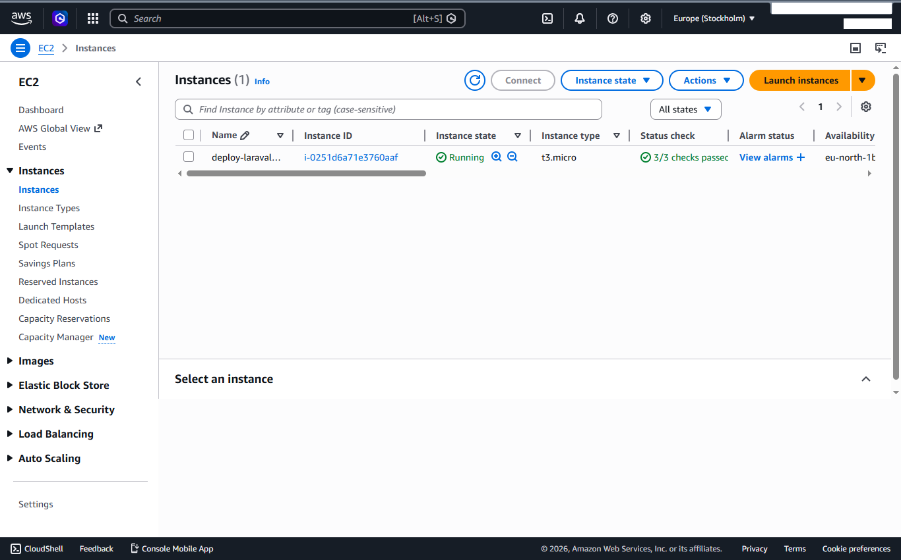  

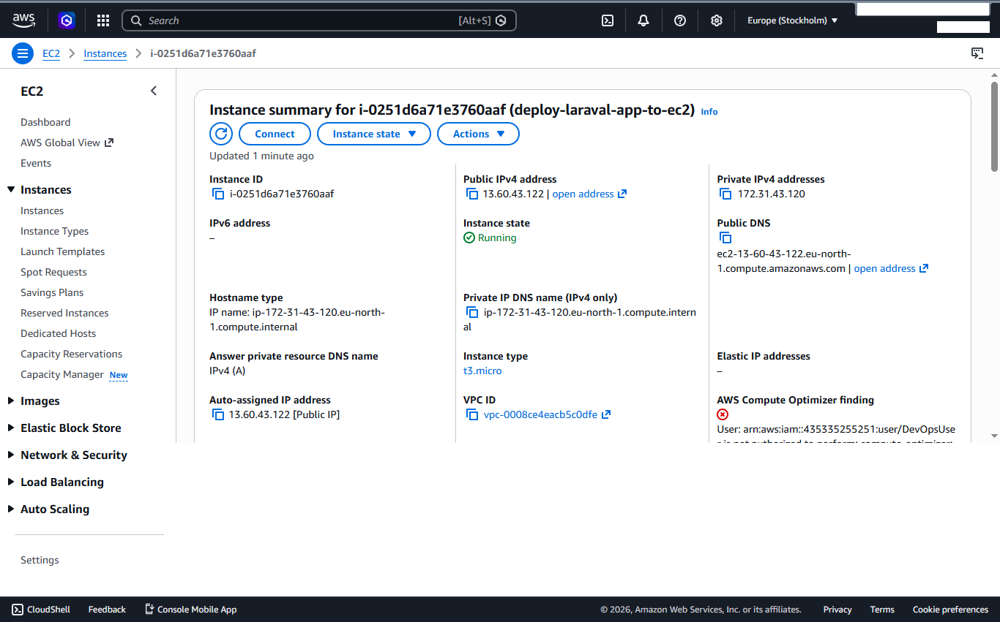  

- This is the RDS database we obtain after running the IAC ( Infrastructure as Code ) :

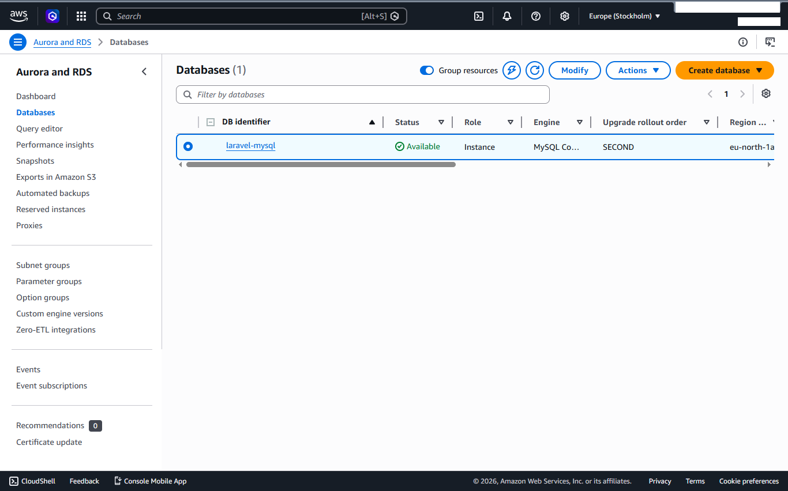  

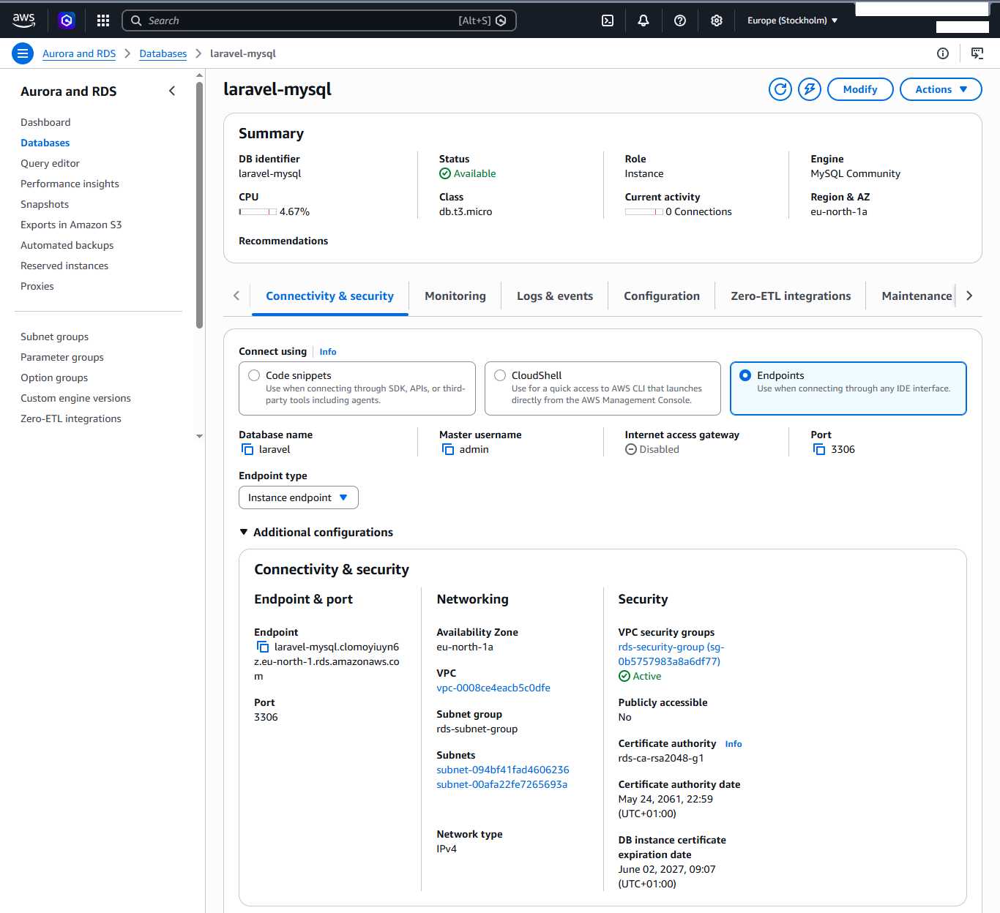  

**4. EC2 Access Configuration :**

- Create the SSH configuration directory.
- Retrieve the EC2 private key from GitHub Secrets.
- Add the EC2 host fingerprint to known hosts.
- Generate a dynamic Ansible inventory file.

**5. Ansible management :**

- Install Ansible on the GitHub Actions runner.
- Passe database configuration variables to Ansible.
- Execute the deployment playbook on the target EC2 instance.

**6. Dockerized application :**

- Install Docker Engine.
- Add the `ubuntu` user to the Docker group.
- Enable and start the Docker service.
- Build Docker images using Docker Compose.
- Start application containers in detached mode.
- Passe database connection variables to containers.

**7. Application access :**

- You can now access the EC2 instance via the web using public ip address ( in our case `13.60.43.122` ) :

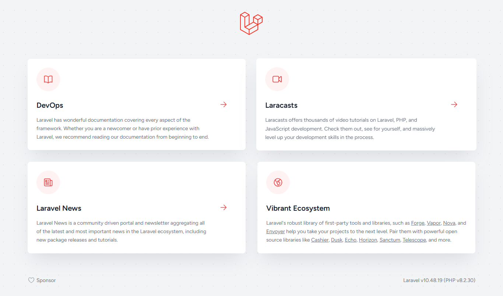  

- On the other hand, you can now access the PHPMyAdmin panel via the web using public ip address with port ( in our case `13.60.43.122:8080` ), and login using the credentials we previously knew ( `DB_USERNAME` and `DB_PASSWORD` ) :

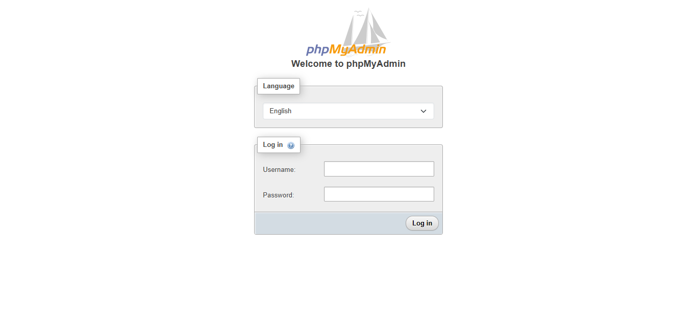   
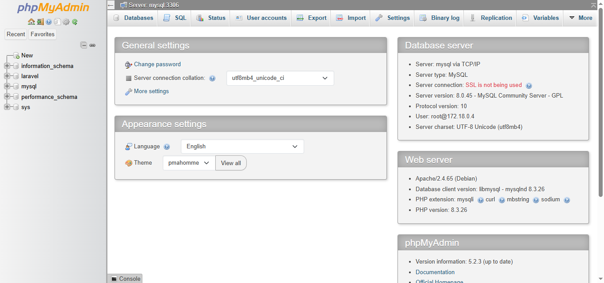   
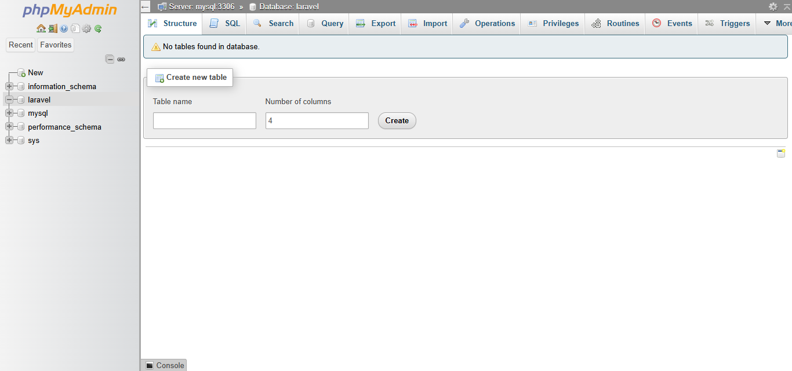  

**⚠️ Important Note:**

It is not recommended to provide any method for access the PHPMyAdmin panel in the production environment ( we did this for illustrative purposes only ).

## Contributing

We welcome contributions! Please follow these guidelines :

- Fork the repository and create a new branch for your feature or fix.
- Write clear commit messages and document your code.
- Ensure all tests pass before submitting a pull request.
- Follow the established code style and project structure.
- Open an issue for discussion before major changes.

## License

This project is open-sourced under the [MIT License](LICENSE).

---

Thank you for using `deploy-laravel-app-to-ec2`! For questions or support, please open an issue on GitHub.
