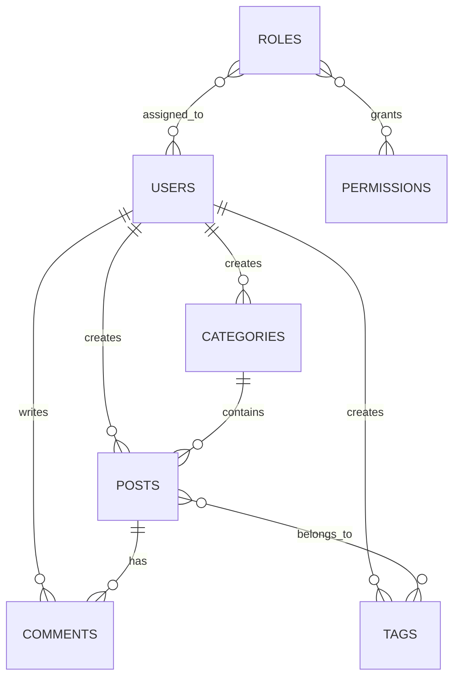

# CMS Roles & Permissions

## Introduction

The `cms-roles-permissions` repository is REST API that provides authentication, authorization, and role-based access control for content management systems ( CMS ).

The project implements a complete user management system using Laravel Policies and the Spatie Permission package, allowing administrators to manage users, roles, permissions, posts, categories, tags, comments, and notes through a modular architecture, secure, and extensible API.

## Features

- Modular architecture for easy customization and scalability.
- User authentication and role-based access control.
- RESTful API for seamless integration with frontend frameworks.
- Media management for images and files.
- Dashboard with analytics widgets and content overview.
- SEO-friendly URLs and metadata management.

## Project Structure

The application follows a layered architecture :

- Controllers handle incoming requests.
- Services contain business logic.
- Policies manage authorization.
- Form Requests handle validation.
- Resources transform API responses.
- Models interact with the database.

## Database Schema


## Database Schema



## Authorization Flow

The application implements a hybrid authorization model using :

* Spatie Laravel Permission for permissions
* Laravel Policies for ownership and hierarchy validation

### Role Hierarchy

The system defines a hierarchy between roles :

```text
Admin (Level 3)
       ↑
Editor (Level 2)
       ↑
Author (Level 1)
```

This hierarchy is used when deleting resources.
A higher role can delete resources created by lower roles.
A lower role can never delete resources owned by higher roles.

### Permission-Based Authorization

#### Category Permissions

| Permission      |
| --------------- |
| create_category |
| update_category |
| delete_category |

#### Tag Permissions

| Permission |
| ---------- |
| create_tag |
| update_tag |
| delete_tag |

#### Post Permissions

| Permission  |
| ----------- |
| create_post |
| update_post |
| delete_post |

#### Comment Permissions

| Permission     |
| -------------- |
| create_comment |
| update_comment |
| delete_comment |

#### Role Permissions

| Permission  |
| ----------- |
| view_roles  |
| create_role |
| update_role |
| delete_role |

### Ownership Rules

For updates, users may only modify resources they created.

#### Categories

```text
Can Update Category ?
        ↓
Has update_category permission ?
        ↓
Category owner ?
        ↓
Yes → Access Granted
No  → Access Denied
```

#### Tags

```text
Can Update Tag ?
        ↓
Has update_tag permission ?
        ↓
Tag owner ?
        ↓
Yes → Access Granted
No  → Access Denied
```

#### Posts

```text
Can Update Post ?
        ↓
Has update_post permission ?
        ↓
Post owner ?
        ↓
Yes → Access Granted
No  → Access Denied
```

#### Comments

```text
Can Update Comment ?
        ↓
Has update_comment permission ?
        ↓
Owns the related post ?
        ↓
Yes → Access Granted
No  → Access Denied
```

### Deletion Rules

Deletion follows ownership and hierarchy validation.

#### Same Owner

Users can delete resources they own.

```text
Resource Owner
    ↓
Delete Own Resource
    ↓
Allowed
```

#### Higher Role

Users can delete resources owned by lower roles.

Example :

```text
Admin deletes Editor post
    ↓
Allowed
```

```text
Admin deletes Author post
    ↓
Allowed
```

```text
Editor deletes Author post
    ↓
Allowed
```

#### Equal Role

Users cannot delete resources owned by another user with the same role.

Example :

```text
Admin A deletes Admin B post
    ↓
Denied
```

```text
Editor A deletes Editor B post
    ↓
Denied
```

```text
Author A deletes Author B post
    ↓
Denied
```

### Lower Role

Users cannot delete resources owned by higher roles.

Example :

```text
Author deletes Editor post
    ↓
Denied
```

```text
Author deletes Admin post
    ↓
Denied
```

```text
Editor deletes Admin post
    ↓
Denied
```

### Special User Rules

The primary administrator account is protected.
User ID 1 cannot be updated or deleted :

```php
if ($targetUser->id == 1) {
    return false;
}
```

This prevents accidental modification or deletion of the system administrator.

### Special Role Rules

Roles assigned to users cannot be deleted :

```php
if ($role->users->count()) {
    return false;
}
```

A role must first be detached from all users before it can be removed.

### Authorization Matrix

| Resource   | Create     | Update                   | Delete                         |
| ---------- | ---------- | ------------------------ | ------------------------------ |
| Categories | Permission | Owner Only               | Owner or Higher Role           |
| Tags       | Permission | Owner Only               | Owner or Higher Role           |
| Posts      | Permission | Owner Only               | Owner or Higher Role           |
| Comments   | Permission | Post Owner Only          | Post Owner or Higher Role      |
| Users      | Permission | Permission + Not User #1 | Permission + Not User #1       |
| Roles      | Permission | Permission               | Permission + No Assigned Users |

This design combines Role-Based Access Control, resource ownership, and role hierarchy enforcement to provide fine-grained authorization throughout the application.

## Requirements

Before installing, ensure your environment meets these requirements :

- PHP ( version 8.x )
- Laravel ( version 10.x )
- MySQL database
- Composer
- Web server ( Xampp )

## Installation

Follow these steps to install and set up `cms-roles-permissions` project :

1. **Clone the repository :**
   ```bash
   git clone https://github.com/rayanguendouz/cms-roles-permissions.git
   cd cms-roles-permissions
   ```

2. **Install dependencies :**
   ```bash
   composer install
   ```

3. **Create the environment file :**

    ```bash
    cp .env.example .env
    ```

4. **Configure your database credentials in .env :**
    ```.env
    DB_CONNECTION=mysql
    DB_HOST=127.0.0.1
    DB_PORT=3306
    DB_DATABASE=cms-roles-permissions
    DB_USERNAME=root
    DB_PASSWORD=
    ```

5. **Generate the application key :**
    ```bash
    php artisan key:generate
    ```

6. **Run database migrations and seeders :**
   ```bash
   php artisan migrate --seed
   ```

7. **Create a symbolic link for storage :**
    ```bash
    php artisan storage:link
    ```

## Usage

Follow these steps to run `cms-roles-permissions` project :


1. **Run the application :**
   ```bash
   php artisan serve
   ```

2. **Access the API :**
   - API base URL : [http://localhost:8000/v1/api](http://localhost:8000/v1/api)


## API testing with Postman

You can test all available API endpoints using the provided Postman collection.

### 1. Download the Collection

[CMS Roles Permissions Postman Collection](collection.json)

### 2. How to Use

1. Open [Postman](https://www.postman.com/downloads/)
2. Click `Import` and Choose the file you downloaded above.
3. Set the `url` environment variable to your API base URL (e.g `http://127.0.0.1:8000/api/v1`)
4. Use the available requests grouped under :  
   📁 Guest Routes  
       │  
   📁 Auth Routes  
       ├── 📁 Dashboard  
       ├── 📁 Categories  
       ├── 📁 Tags  
       ├── 📁 Roles  
       ├── 📁 Users  
       ├── 📁 Comments  
       ├── 📁 Notes  
       │  
   📁 Front Routes  
       ├── 📁 Home  
       ├── 📁 Blog  
       └── 📁 Comments  

5. Check the full documentation via the following link : https://documenter.getpostman.com/view/YOUR_WORKSPACE_ID/YOUR_DOCUMENT_ID

## Contributing

We welcome contributions! Please follow these guidelines :

- Fork the repository and create a new branch for your feature or fix.
- Write clear commit messages and document your code.
- Ensure all tests pass before submitting a pull request.
- Follow the established code style and project structure.
- Open an issue for discussion before major changes.

## License

This project is open-sourced under the [MIT License](LICENSE).

---

Thank you for using `cms-roles-permissions`! For questions or support, please open an issue on GitHub.
